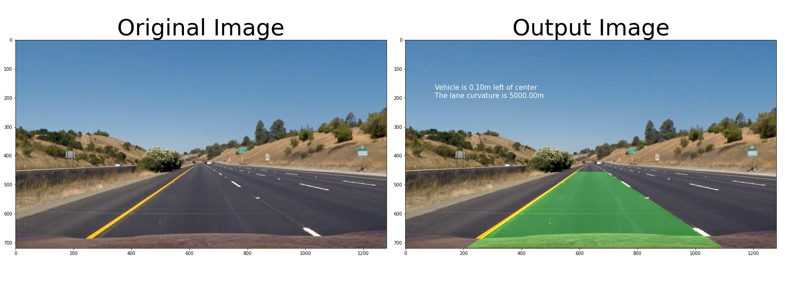

## Advanced Lane Finding

## Installation

**Step 1:** Set up the [CarND Term1 Starter Kit](https://github.com/udacity/CarND-Term1-Starter-Kit/blob/master/README.md).

**Step 2:** Open the code in a Jupyter Notebook

`> jupyter notebook`

## Known Bugs
* The shadow of the tree on the roadside might be regarded as part of lane in some light condition.
* White lane has better fit than yellow lane. 
